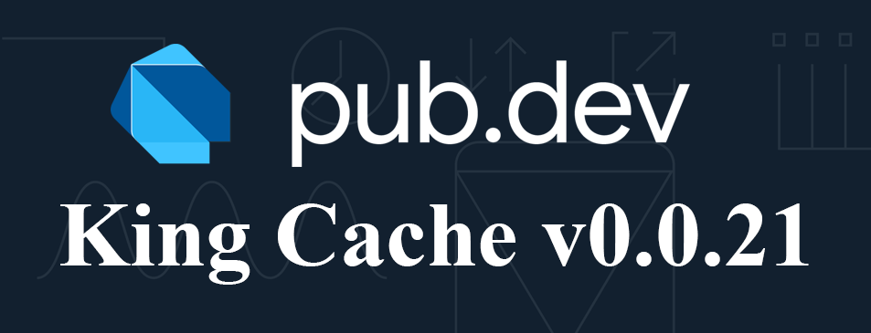
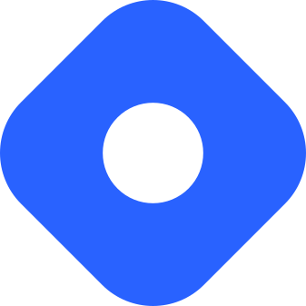

<h1 align="center"></h1>

- 🦁 Welcome to **[King Technologies](https://kingtechnologies.dev "King Tech")**

- 🏮 I’m currently working on my **[Rust](https://www.rust-lang.org/)** skills

- 💬 I enjoy Tech Talks and collaborating on **[Project Initiator](https://github.com/king-technologies/Project_Initiator "Project Initiator")**

- ⚡ Fun fact **Passion significantly boosts your ability to learn new things!**

  🚀 Committed to consistently delivering top-tier solutions across diverse projects, driven by a passion for innovation and excellence. With a strong technical foundation and a continuous drive to stay ahead of the curve, I thrive on creating impactful, user-centric technologies that push boundaries and elevate experiences.

 

  
  
  
  
  
  

<h2 align="center">🌟 Tech Stack 🌟</h2>

  <picture>
    <source srcset="./assets/images/rust_white.svg" media="(prefers-color-scheme: dark)">
    
  </picture>
  
  &nbsp;
  <picture>
    <source srcset="./assets/images/nextjs_white.svg" media="(prefers-color-scheme: dark)">
    
  </picture>
  &nbsp;
  
  
  &nbsp;
  
  &nbsp;
  
  &nbsp;
  <picture>
    <source srcset="./assets/images/deno_white.svg" media="(prefers-color-scheme: dark)">
    
  </picture>
  
  
  &nbsp;
  
  &nbsp;
  
  &nbsp;
  
  

 
<h2 align="center">🚀 Super Projects 🚀</h2>

  
   
  <b> <a href="https://play.google.com/store/apps/details?id=dev.kingtechnologies.lineup" target="_blank">Line Up</a></b> - Task Management App for individuals who want to focus on task completion and keep track of things

  
   
  <b> <a href="https://pub.dev/packages/king_cache" target="_blank">King Cache</a></b> - Easy to use cache management for Flutter

  <b><a href="https://github.com/king-technologies/Project-Initiator" target="_blank">Project Initiator</a></b> - Start your project with a single command 🔥, First Commit, Funding links, add to workspace and more
   
   
  <b><a href="https://kings-library.vercel.app/" target="_blank">MyQueueBox</a> </b>- Personal space for managing and organizing YouTube, playlists & links. Designed for ease and efficiency, it allows you to save videos for later viewing, organize your content with ease. Keep your library neatly stored and always ready for whenever you're in the mood to watch or read.

  

<h2 align="center">🌟 Blogs 🌟</h2>

  
  

<h2 align="center">🤍 Stats 🤍</h2>

  
  

  <!--  -->
 

  
  

  

<!-- 

  

 -->

  <picture>
    <source media="(prefers-color-scheme: dark)" srcset="https://raw.githubusercontent.com/rohit19060/rohit19060/output/github-contribution-grid-snake-dark.svg">
    <source media="(prefers-color-scheme: light)" srcset="https://raw.githubusercontent.com/rohit19060/rohit19060/output/github-contribution-grid-snake.svg">
    
  </picture>

  
Trophies

  

    
  

<h2 align="center">🤝 Support 🤝</h2>

  🎀 Contributions (<a href="https://guides.github.com/introduction/flow" title="GitHub Flow">GitHub Flow</a>), 🔥 issues, and 🥮 feature requests are most welcome!
   
  💙 If you like my projects, give them ⭐ and share them with friends!

  Made with ❤️ in India
   
  If you'd like to discuss any opportunity, feel free to <a href="mailto:rohitjain19060@gmail.com" title="Email me">Contact me</a>

