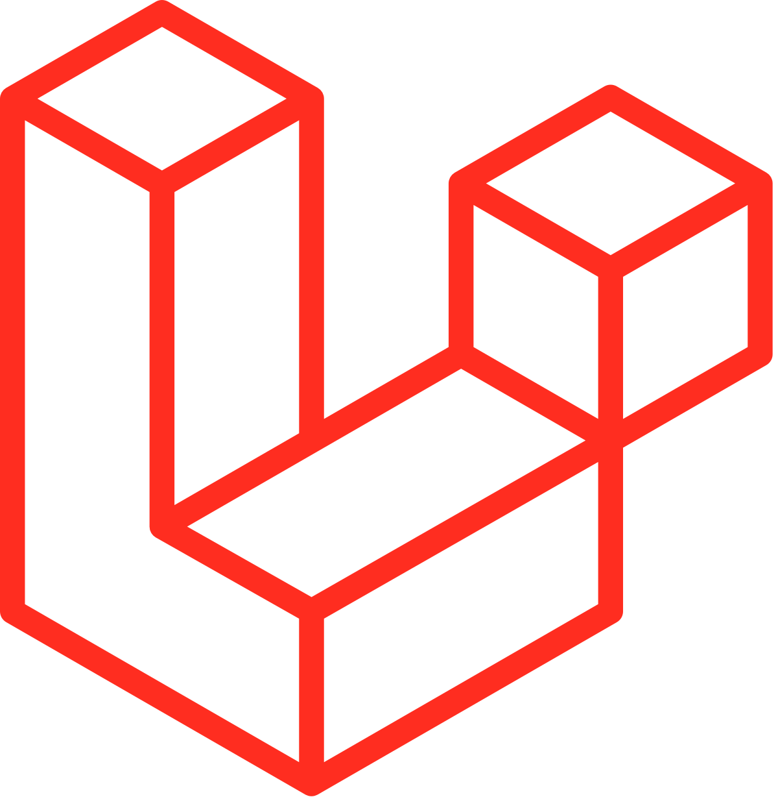

<h1 align="center">⚡ Full-Stack Engineer Building Fast, Scalable & Intelligent Software</h1> 
 <strong>Rust · SvelteKit · Next.js · TypeScript · Cloudflare</strong> 

---

### 🧩 Featured Projects

#### 🧩 AARVI — AI Assistant with Real & Virtual Intelligence (Active Development)

A privacy-focused conversational AI assistant built around a Rust core, with web and native desktop interfaces. Bringing social connections, productivity tools, and AI capabilities into one place.
**Tech:** Rust (Core) · SvelteKit (Web Interface) · GPUI (Desktop UI) · Cloudflare Tunnel

#### [🚀 Project Initiator](https://initiator.kingtechnologies.dev/) (Active Development)

CLI + UI tool that scaffolds full projects with DevOps integration.  
**Tech:** Multi-language project scaffolding · SvelteKit (Web Interface) · Rust (Backend) · Postgres (Database) · Cloudflare Tunnel

#### [⌨️ Typing Friend](https://typing-friend.kingtechnologies.dev/) (Active Development)

Multiplayer typing app with an AI coach.  
**Tech:** SvelteKit (Web Interface & Backend) · Tailwind (Styling) · Firebase (DB & Storage) · AI (Coach) · Cloudflare Worker & KV

#### [🛍️ Methi Collection](https://methicollection.com/)

Full-featured e-commerce site with payments and admin dashboard.  
**Tech:** SvelteKit (Web Interface & Backend) · Tailwind (Styling) · Supabase (Storage) · Cloudflare Worker & KV • Turso (DB) • Razorpay (Payment Gateway)

#### [🧵 Niya Saree Center](https://niyasareecenter.com/)

Premium e-commerce platform for all types of sarees.
**Tech:** SvelteKit (Web Interface & Backend) · Tailwind (Styling) · Supabase (Storage) · Cloudflare Worker & KV • Turso (DB) • Razorpay (Payment Gateway)

#### [🎬 Queue Box](https://queue-box.kingtechnologies.dev/)

Save and manage videos & learning resources
**Tech:** SvelteKit (Web Interface & Backend) · Cloudflare (Worker) · IndexedDB (Offline Storage) · Tailwind (Styling)

---

### ⚙️ Tech Stack

<picture>
    <source srcset="./assets/images/rust_white.svg" media="(prefers-color-scheme: dark)">
    
  </picture>   &nbsp;   &nbsp;
   &nbsp;
   &nbsp;
   <picture>
    <source srcset="./assets/images/nextjs_white.svg" media="(prefers-color-scheme: dark)">
    
  </picture> &nbsp;
   &nbsp;
  &nbsp;
  &nbsp;
&nbsp;
&nbsp;
&nbsp;
&nbsp;
&nbsp;
&nbsp;
    
    &nbsp;
    <picture>
      <source srcset="./assets/images/deno_white.svg" media="(prefers-color-scheme: dark)">
      
    </picture>
    &nbsp;
    
    &nbsp;

---

### 📝 Technical Writings

📖 [Dev.to](https://dev.to/rohit19060)

- [Vitest: Modern Test-Driven Development Made Easy](https://dev.to/rohit19060/vitest-modern-test-driven-development-made-easy-4ec3)
- [Feature Flags: The Release Superpower You're Missing](https://dev.to/rohit19060/feature-flags-the-release-superpower-youre-missing-1n3a)
- [`just` Is My Go-To Command Now](https://rohit19060.hashnode.dev/just-is-my-go-to-command-now)
- [How to Write Stunning Github README.md [Template Provided]](https://dev.to/rohit19060/how-to-write-stunning-github-readme-md-template-provided-5b09)
- [How to Write Tests in Postman - API Testing](https://dev.to/rohit19060/how-to-write-tests-in-postman-api-testing-4pnn)

---

### 🎥 [YouTube Channel](https://www.youtube.com/channel/UCBkOLsuxGJJRVyV2UIK9alQ?sub_confirmation=1)

🎬 Tutorials · Projects · Live Coding · Dev Tools

- [Rainmeter Tutorial and Create Your Own Rainmeter Skin](https://www.youtube.com/watch?v=GG7rVrcTSIQ)
- [Virtual Assistant using Python](https://www.youtube.com/watch?v=LQr3iyLHiU8)
- [Animated Progress Bar | Flutter | Custom Widget](https://www.youtube.com/watch?v=2MksC_X9_Qo)
- [Project Initiator using Python](https://www.youtube.com/watch?v=ud4P45zhCk0)
- [Rust Basics and Installation](https://www.youtube.com/watch?v=CW-i0KAGuYI)

---

  

---

### 🤝 Support Open Source

Your support helps me create more open-source projects and educational content. 💙

🎀 Contributions (<a href="https://guides.github.com/introduction/flow" title="GitHub Flow">GitHub Flow</a>), 🔥 issues, and 🥮 feature requests are always welcome!
💙 If you like my projects, give them ⭐ and share them with friends!

---

  Made with ❤️ and Enthusiasm in India  
   
  📧 <a href="mailto:rohitjain19060@gmail.com">rohitjain19060@gmail.com</a>

