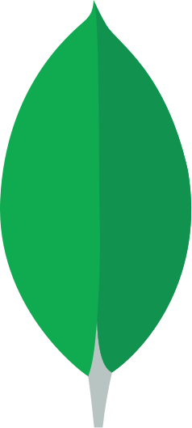

<h1 align="center">⚡ Building Scalable & Impactful Experiences</h1>

  <strong>Full Stack Engineer | 6+ Years of Experience</strong>

---

### 🧩 Featured Projects  

#### [⌨️ Typing Friend](https://typing-friend.vercel.app/practice)  (Active development)
Multiplayer typing app with an AI coach.  
**Tech:** SvelteKit · Tailwind · Firebase · AI · Vercel  

#### [🚀 Project Initiator](https://project-initiator-ui.vercel.app/)  (Active development)
CLI + UI tool that scaffolds full projects with DevOps integration.  
**Tech:** All Languages & Frameworks · SvelteKit · Rust · Postgres · Cloudflare Tunnel  

#### [🧵 Niya Saree Center](https://niya-saree-center-2gxs.vercel.app/)  (Active development)
Premium e-commerce platform for All types of sarees.  
**Tech:** SvelteKit · Tailwind · Supabase · Firebase · Vercel  

#### [🛍️ Methi Collection](https://methicollection.com/)  
Full-featured e-commerce site with payments and admin dashboard.  
**Tech:** Next.js · Tailwind · Supabase · Razorpay  

#### [🎬 Queue Box](https://queue-box.vercel.app/)  
Save and manage videos and learning resources.  
**Tech:** SvelteKit · Vercel · IndexedDB · YouTube  

---

### ⚙️ Tech Stack  

**💪 Strong Expertise:**  

   &nbsp;
   &nbsp;
   <picture>
    <source srcset="./assets/images/nextjs_white.svg" media="(prefers-color-scheme: dark)">
    
  </picture> &nbsp;
   &nbsp;
  &nbsp;
  &nbsp;
  &nbsp;
  &nbsp;
  &nbsp;
  &nbsp;
  &nbsp;
  &nbsp;
  &nbsp;
  &nbsp;

**🌱 Growing Expertise:**  

  <picture>
      <source srcset="./assets/images/rust_white.svg" media="(prefers-color-scheme: dark)">
      
    </picture>   &nbsp; 
    
    &nbsp;
    <picture>
      <source srcset="./assets/images/deno_white.svg" media="(prefers-color-scheme: dark)">
      
    </picture>
    &nbsp;
    
    &nbsp;
    

---

### 📝 Blogs  
📖 [Dev.to](https://dev.to/rohit19060)  ·  [Hashnode](https://rohit19060.hashnode.dev/)  

- [How to Write Stunning Github README.md [Template Provided]](https://dev.to/rohit19060/how-to-write-stunning-github-readme-md-template-provided-5b09)
- [How to Write Tests in Postman - API Testing](https://dev.to/rohit19060/how-to-write-tests-in-postman-api-testing-4pnn)
- [What's new in Flutter 3.3](https://dev.to/rohit19060/whats-new-in-flutter-33-leh)
- [AI OS — The Operating System](https://forem.com/rohit19060/ai-os-the-first-operating-system-built-by-humanity-for-humanity-1okf)
- [How to Create a PWA](https://rohit19060.hashnode.dev/how-to-create-a-pwa)

---

### 🎥 [YouTube Channel](https://www.youtube.com/channel/UCBkOLsuxGJJRVyV2UIK9alQ?sub_confirmation=1)  
🎬 Tutorials · Projects · Live Coding · Dev Tools  

- [Rainmeter Tutorial and Create Your Own Rainmeter Skin](https://www.youtube.com/watch?v=GG7rVrcTSIQ)  
- [Virtual Assistant using Python](https://www.youtube.com/watch?v=LQr3iyLHiU8)  
- [Animated Progress Bar | Flutter | Custom Widget](https://www.youtube.com/watch?v=2MksC_X9_Qo)  
- [Project Initiator using Python](https://www.youtube.com/watch?v=ud4P45zhCk0)  
- [Rust Basics and Installation](https://www.youtube.com/watch?v=CW-i0KAGuYI)

---

  

---

### 🤝 Support My Work  
Your support helps me create more open-source and educational content 💙  

🎀 Contributions (<a href="https://guides.github.com/introduction/flow" title="GitHub Flow">GitHub Flow</a>), 🔥 issues, and 🥮 feature requests are most welcome!
💙 If you like my projects, give them ⭐ and share them with friends!

---

  Made with ❤️ and curiosity in India  
   
  📧 <a href="mailto:rohitjain19060@gmail.com">rohitjain19060@gmail.com</a>

